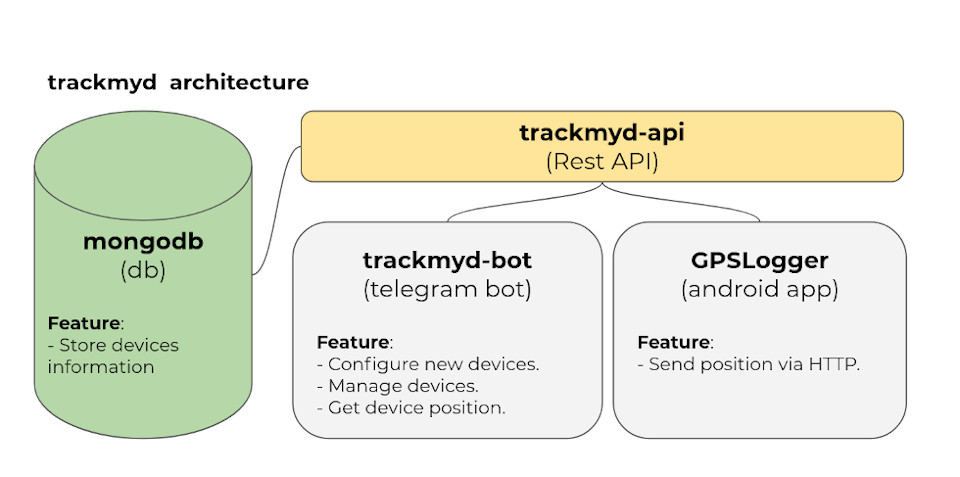

<h1 align="center">Welcome to trackmyd-bot 🗺️</h1>
<p>
  <a href="https://github.com/franjsco/trackmyd-bot/graphs/commit-activity" target="_blank">
    
  </a>
  <a href="https://github.com/franjsco/trackmyd-bot/blob/master/LICENSE" target="_blank">
    
  </a>
  <a href="https://twitter.com/franjsco" target="_blank">
    
  </a>
</p>

> A telegram bot to track your devices.


 


## Install


Steps:
1. Install **Node.js** and **npm**.
2. Clone this repository.
3. Install dependencies with `npm install`.
4. Create a new bot with **@BotFather** on Telegram.
5. Enter the **token** generated by BotFather in (app.token) into `config.json`.
6. Enter your **Telegram ID** in (app.authorizedUsers) into `config.json`.
7. Configure Basic Authentication in (app.api.headers) into `config.json`.
8. Configure API endpoint(*).

### Architecture 
(*) **trackmyd-bot** uses the [**trackmyd-api**](https://github.com/franjsco/trackmyd-api) project APIs to get device locations. 

To configure the server API, refer to the  [**trackmyd-api**](https://github.com/franjsco/trackmyd-api) repository.

In order to use trackmyd-bot, in addiction to the configuration of the trackmyd-api, it’s also necessary to configure [**GPSLogger**](https://github.com/mendhak/gpslogger).




## Usage
Start server:
```sh
npm run start
```

### Steps
Before requesting the position to the bot you need to add a new device and configure it.

1. **Add a new device (on Bot).**

    Send the `/add` command to the bot. You will be prompted to add the device name.

2. **Configure GPSLogger (on Android).**

    Once confirmed the device name, the bot will return 3 messages:

    - URL (full-path including the device ID)
    - HEADER (HTTP header, used for authentication to APIs)
    - BODY (HTTP body with the parameters that will be automatically evaluated by GPSLogger).
    
    Take the values ​​and insert them in the GPSLogger app under "Logging details > Log to custom URL" specifying HTTP Method = 'PATCH'. 

    Then press "Start Logging" on GPSLogger.

3. **Request the position (on Bot)**

    Send the `/position` command to the bot and select the device. If the device (with GPSLogger) has sent the information to the API, 2 messages will be returned (one with the location on the map, and one with additional information).

## Author

👤 **franjsco (Francesco Esposito)**

* Website: https://franjsco.github.io/
* Twitter: [@franjsco](https://twitter.com/franjsco)
* Github: [@franjsco](https://github.com/franjsco)

## Show your support

Give a ⭐️ if this project helped you!

## 📝 License

Copyright © 2020 [franjsco (Francesco Esposito)](https://github.com/franjsco).<br />
This project is [GPL--3.0--or--later](https://github.com/franjsco/trackmyd-bot/blob/master/LICENSE) licensed.

***
_This README was generated with ❤️ by [readme-md-generator](https://github.com/kefranabg/readme-md-generator)_