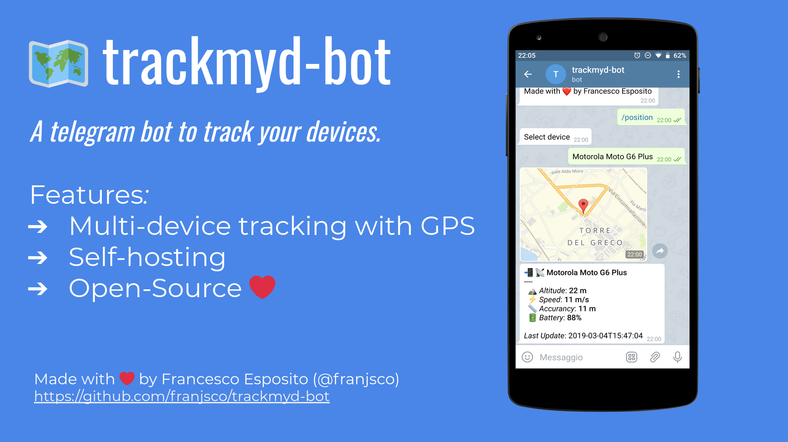

# trackmyd-bot

A telegram bot to track your devices.

This bot is written in Node.js

## Architecture

**trackmyd-bot** uses the [**trackmyd-api**](https://github.com/frab1t/trackmyd-api) project APIs to get device locations. 

To configure the server, refer to the  [**trackmyd-api**](https://github.com/frab1t/trackmyd-api) repository.

In order to use trackmyd-bot, in addiction to the configuration of the trackmyd-api, it’s also necessary to configure [**GPSLogger**](https://github.com/mendhak/gpslogger), an open-source application that allows sending location through HTTP calls.

## Usage

Before requesting the position to the bot you need to add a new device and configure it.

1. **Add a new device.**

    Send the `/add` command to the bot. You will be prompted to add the device name.

2. **Configure GPSLogger on Android.**

    Once confirmed the device name, the bot will return 3 messages:

    - URL (full-path including the device ID)
    - HEADER (HTTP header, used for authentication to APIs)
    - BODY (HTTP body with the parameters that will be automatically evaluated by GPSLogger).
    
    Take the values ​​and insert them in the GPSLogger app under "Logging details > Log to custom URL" specifying HTTP Method = 'PATCH'. 

    Then press "Start Logging" on GPSLogger.

3. **Request the position at the bot**

    Send the `/position` command to the bot and select the device. If the device (with GPSLogger) has sent the information to the API, 2 messages will be returned (one with the location on the map, and one with additional information).

## Installation

### Step by step

1. Install **NodeJS** and **NPM**.
2. Clone this repository.
3. Install dependencies with `npm install`.
4. Create a new bot with **BotFather** on Telegram
5. Enter the **token** generated by BotFather in (app.token) into `config.json`.
6. Enter your **Telegram ID** in (app.authorizedUsers) into `config.json`.
7. Configure Basic Authentication in (app.api.headers) into `config.json`.
8. Start with `npm start`.

### License

GPLv3

---
Made with ❤️ by Francesco Esposito ([@frab1t](https://github.com/frab1t))
